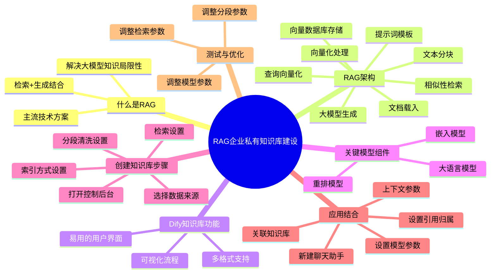
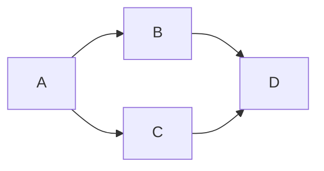

# Dify应用：RAG企业私有知识库建设

## 课程信息

内容来源：DIFY大模型应用实战【共12课时】_大模型开发+架构＋多模态课程/第四章 RAG企业私有知识库建设

## 1. 什么是RAG企业私有知识库

大家好，这节课我们来介绍如何通过检索增强生成（RAG）实现企业内部的私有知识库。大语言模型的训练数据通常基于公开数据，且每次训练都需消耗大量算力。这意味着大语言模型所具备的知识不包含私有领域知识，同时在公开知识领域也存在一定滞后性。

目前，以向量检索为核心的检索增强生成（RAG）技术，是解决大语言模型获取最新外部知识的较主流技术方案。许多开源框架，如 `Dify` 或 `FastGPT`，都能低成本实现RAG，助力我们轻松搭建AI智能客服、企业智能知识库或私有AI搜索引擎。

简言之，RAG的作用是帮助大语言模型临时性获取其不具备的外部知识，允许大模型在回答问题前先寻找答案。

## 2. RAG架构与工作原理

我们来看RAG的架构图。首先，知识库文档（如TXT、Markdown或PDF格式）先经过载入，然后被切割成一个个文本块，通过相应的嵌入模型进行向量化处理，最终将向量化后的结果存入向量数据库。

外部用户通过提示词进行数据内容查询，用户的查询同样会被向量化处理，接着进行向量相似性检查，最终向向量数据库查询，得到相应结果。返回的结果经过提示词模板处理后，交给大语言模型，最终生成用户所需答案。

该知识库是文档的集合，可整体集成到应用中作为检索上下文使用。`Dify` 知识库功能能实现RAG流水线上每个环节的可视化，并且为我们提供了一套简单易用的用户界面，方便用户轻松构建个人或团队知识库，并快速集成到相应AI应用中。

目前，`Dify` 支持多种数据源格式，如TXT、Markdown、Word文档、网页JSON数据、PDF、CSV以及Excel格式。

## 3. 关键模型组件

如果想在企业内部建设一个私有知识库，并期望获得高质量的使用体验，单纯使用大语言模型是不够的。我们还需结合：

- **向量化模型（嵌入模型）**：将文本转换为向量表示
- **重排模型**：对检索结果进行排序优化

在本课程中，我们会将这几个模型结合使用，并在后续实操例子中为大家演示。嵌入模型和重排模型通过 `Xinference` 管理，所以我们需要安装好 `Xinference` 模型管理工具，并下载好相关模型。

## 4. 在Dify中创建知识库

### 4.1 打开控制后台并创建知识库

打开 `Dify` 的控制后台，找到知识库按钮，点击后可看到已有知识库，我们选择新建一个知识库。

### 4.2 选择数据来源

在新建知识库页面，可选择导入已有文本、使用 `Notion` 内容或同步Web站点内容。在我们的例子中，选择使用本地已有的文本。点击选择文件，将名为 `1.txt` 的文件上传，该文件可视为我们的知识库文档，上传后点击下一步。

### 4.3 分段清洗与索引方式设置

#### 4.3.1 分段清洗

**分段方式**：
- 自动分段：不受控制
- 自动分段清洗：系统自动处理
- 自定义分段清洗：人工配置分段规则

由于大语言模型存在有限的上下文窗口，通常需将整段文本分段处理，再召回与用户问题关联度最高的几个段落，这种召回方式称为分段的 `top-k` 召回方式。合适的分段大小有助于在用户问题与文本分段语义匹配时，减少信息噪音，匹配到关联性最高的文本内容。

**分段依据**：
需指定分段标识符，即文本中出现何种类型符号时认为是一段，这需要对知识库原数据非常熟悉。在实际操作前，需人工对原始数据进行预处理，若模型分段清洗结果不满意，还需人工微调，这其实是一个数据标注过程。

例如，在我的文档中，用 `\n` 表示换行符作为分段标识符。此外，还需设置：
- **分段最大长度**：每个分段的文本字符上限，如设置为500
- **分段重叠长度**：分段之间的重叠字数，建议取值在最大分段长度的10% - 25% 之间

**清洗规则**：
可设置替换连续的空格、换行符、制表符，或删除文档中的URL、电子邮件地址等。在我们的例子中，因后续要做图文生成，只选择替换连续的空格、换行符、制表符。

#### 4.3.2 索引方式

**高质量模式**：
推荐使用，该模式将调用系统默认的嵌入接口进行处理，以提高用户查询时的准确度。在 `Dify` 平台下，会调用 `BGE large` 嵌入模型。

**经济模式**：
采用关键词索引方式，准确度较低，但不需要耗费 `token`。由于我们的嵌入模型已本地私有化部署，不存在消耗 `token` 付费问题，所以不选择此模式。

**QA分段模式**：
与高质量模式和经济模式不同，高质量和经济模式为 `q-to-p`（`q` 代表 `question`，`p` 代表段落）匹配方式，而 `QA` 模式采用 `q-to-q` 的问题匹配方法，即通过用户提问找出与之最相似的问题，再返回对应的分段作为答案。

若要使用此模式，原始文档需处理成 `QA` 形式，如“Q：金陵银行办公生产网络目前有多少个数据中心，A：金陵银行办公生产网络目前有三个数据中心及多少个分支机构等”。但在大多数场景下，将现有文档转换为这种形式耗费人力精力，不现实，所以我们的例子中不使用此模式。

### 4.4 检索设置

**向量检索**：
对用户查询语句进行向量化，通过查询语句向量做向量匹配，找到最相似的文本分段。筛选到与用户问题相似度最高的文本片段后，通过 `top-k` 参数指定召回的分段数量，`score` 参数用于设置文本片段筛选的相似度阈值。

**全文检索**：
索引文档中所有词汇，允许用户查询任意词汇，并返回包含这些词汇的相应文本片段。通过 `top-k` 参数筛选与用户问题相似度最高的文本片段。

**混合检索**：
推荐使用，此模式同时执行全文检索和向量检索，并应用重排序步骤，从两类查询结果中选择匹配用户问题的最佳结果，需用到重排模型（在我们系统中由 `Xinference` 托管，使用 `BGE rank large` 模型）。

## 5. 知识库与应用结合

### 5.1 知识库校准

完成上述设置后，点击保存，知识库开始创建并处理，处理完成后前往知识库。此时可看到系统对知识库文档做了自动分段，我们需人工校准分段质量，如点击查看分段内容及关键词等。

我们将知识库 `1.txt` 改名为“金陵银行百事通”，方便后续关联。

### 5.2 新建聊天助手并设置模型参数

新建一个聊天助手，如创建空白应用，命名为聊天型应用，并设置基础编排名称后点击创建。创建后，设置语言模型参数：

- 调低 `temperature` 和 `top-p` 值，目的是让回答更保守，因为这是私有内部知识库，强调返回内容的精确性
- 设置 `top-k` 值为20

### 5.3 关联知识库

在左侧让聊天机器人关联刚才创建的“金陵银行百事通”知识库。在上下文处点击添加，选择“金陵银行百事通”后点击确定。

### 5.4 设置引用和归属

若想知道模型回答内容的来源，点击添加功能按钮，选择引用和归属，启用后将显示原文档和生成内容的归属部分，即标注回答内容源自知识库还是大模型本身。

### 5.5 上下文参数设置

点击上下文的参数设置，有两种方式：

**`N` 选一召回**：
根据用户意图和知识库描述，由 `agent` 自主判断选择最匹配的单个知识库查询相关文本，适合知识库区分度大且数量偏少的应用。

**多路召回**：
根据用户意图同时匹配所有知识库，从多路知识库查询相关文本分片，经过重排序步骤，从多路查询结果中选择匹配用户问题的最佳结果，需配置重排模型。在实际场景中，因公司各部门都有自己的知识库，应用关联的知识库数量多，所以选择多路召回。

## 6. 测试与优化

点击保存后，检查知识库是否生效。先看原文，然后向模型提问，如“金陵银行有多少个数据中心？”，查看模型回复是否在知识库知识范畴内。

若对结果不满意，可从以下方面调整：
1. 调数据的分段方式和参数
2. 调模型的参数
3. 调 `top-k` 以及 `score` 的值

## 7. 修订说明

- **术语统一情况**：将文中 “rug” 统一规范为 “检索增强生成（RAG）”，“ebenin模型” 规范为 “嵌入模型”，“recently er模型” 规范为 “重排模型”，统一了RAG领域专业术语表述，符合行业标准。
- **主要口误修正点**：修正了多处重复表述、冗余语气词和模糊表述。例如，去除 “嗯、啊、这个” 等冗余语气词；修正术语错误，将 "Defect" 统一为 "Dify"。

## 8. XMind思维导图示例

我们现在支持两种思维导图方式：Mermaid mindmap 和 Markmap。

### 1. Markmap 示例（推荐）

Markmap 支持直接使用 Markdown 标题层级，非常适合从 XMind 导出的内容：

::: markmap
# RAG企业私有知识库建设
## 什么是RAG
### 解决大模型知识局限性
### 检索+生成结合
### 主流技术方案
## RAG架构
### 文档载入
### 文本分块
### 向量化处理
### 向量数据库存储
### 查询向量化
### 相似性检索
### 提示词模板
### 大模型生成
## Dify知识库功能
### 多格式支持
### 可视化流程
### 易用的用户界面
## 关键模型组件
### 嵌入模型
### 重排模型
### 大语言模型
## 创建知识库步骤
### 打开控制后台
### 选择数据来源
### 分段清洗设置
### 索引方式设置
### 检索设置
## 应用结合
### 新建聊天助手
### 设置模型参数
### 关联知识库
### 设置引用归属
### 上下文参数
## 测试与优化
:::

### 2. Mermaid Mindmap 示例

### 3. 基础流程图测试

### 4. 替代方案：使用列表形式展示XMind结构

如果Mermaid流程图仍有问题，您也可以使用Markdown列表来展示XMind文档结构：

# RAG企业私有知识库建设

## 一、什么是RAG

- 解决大模型知识局限性
- 检索+生成结合
- 主流技术方案

## 二、RAG架构

- 文档载入
- 文本分块
- 向量化处理
- 向量数据库存储
- 查询向量化
- 相似性检索
- 提示词模板
- 大模型生成

## 三、Dify知识库功能

- 多格式支持
- 可视化流程
- 易用的用户界面

## 四、关键模型组件

- 嵌入模型
- 重排模型
- 大语言模型

## 五、创建知识库步骤

- 打开控制后台
- 选择数据来源
- 分段清洗设置
- 索引方式设置
- 检索设置

## 六、应用结合

- 新建聊天助手
- 设置模型参数
- 关联知识库
- 设置引用归属
- 上下文参数

## 七、测试与优化

- 调整分段参数
- 调整模型参数
- 调整检索参数 